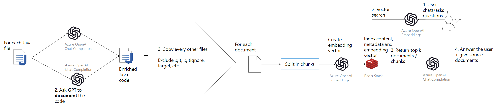

# Ask The Code

Ask the code is a demo project to use Azure OpenAI to talk with your source code.

This project is inspired by [Azure OpenAI Embeddings QnA](https://github.com/ruoccofabrizio/azure-open-ai-embeddings-qna). It creates embeddings vectors from the source code files. Then it uses the Azure OpenAI GPT model to answer questions about the source code.

It is designed to work with Java projects. It uses the GPT model to add context to java code and to document it. The system commands can be updated to support other languages. Then the enriched code is transformed in embeddings vectors and store in a vector store.

The overall flow of the demo is represented on the figure below.

> **NOTE: This project is a demo only. It is not production ready.**

# Run the demo

First the code needs to be enriched and indexed. To do so, you can follow the instructions in the [processing](processing/README.md) folder.

Then you can start the [backend](backend/README.md) and the [frontend](frontend/README.md).

