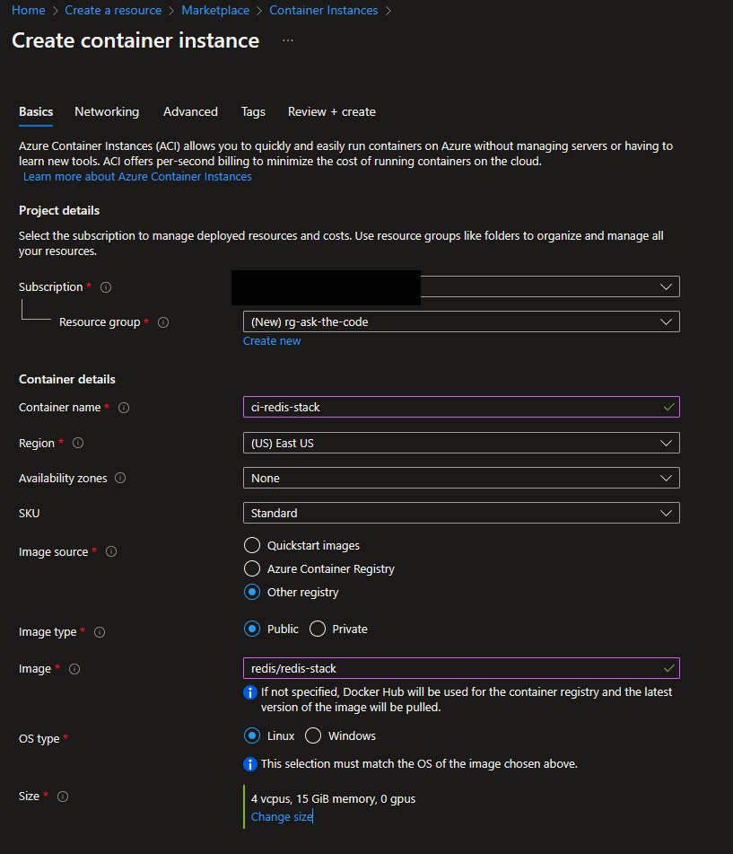
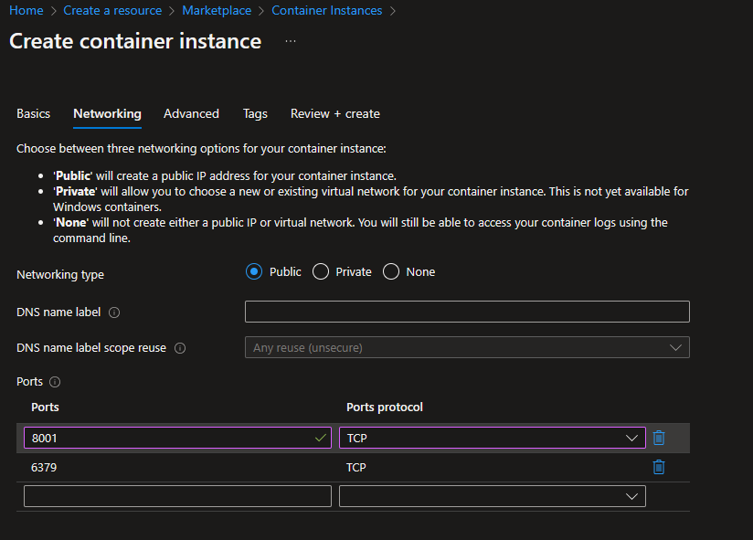

# Source Code Processing

To process the source code, you need to install the dependencies and setup the virtual environment.

The source code is processed by the following steps:

1. The source code is enriched using Jupiter Notebook `01_code_enrichment.ipynb`
2. The enriched source code is indexed using Jupiter Notebook `02_code_indexing.ipynb`

## Setup the virtual environment

```bash
python -m venv ./.venv
cd ./.venv/Scripts
./activate
```

## Install the dependencies

```bash
cd ../..
pip install -r processing/requirements.txt
```

## Setup Vector Store

The vector store used for this demo is currently [Redis Stack](https://redis.io/docs/stack/).

You can also use [Azure Cache for Redis](https://learn.microsoft.com/en-us/azure/azure-cache-for-redis/cache-overview) with the Enterprise tier (RefdiSearch is required). You can find more information here: [Azure OpenAI Embeddings QnA](https://github.com/ruoccofabrizio/azure-open-ai-embeddings-qna#deploy-on-azure-webapp--azure-cache-for-redis-enterprise--batch-processing).

### Setup Redis Stack locally

To setup Redis Stack locally using Docker you can follow the instructions in the [Redis Stack](https://redis.io/docs/stack/get-started/install/docker/) documentation.

### Setup Redis Stack on Azure Container Instances

To setup Redis Stack on [Azure Container Instances](https://learn.microsoft.com/en-us/azure/container-instances/), you create a container instance using `redis/redis-stack` image as shown on the figure below. Be sure to provide enough core and memory to run it smoothly.



Then you need to expose the port `6379` to be able to connect to it and the port `8001` for Redis Insight.



## Run the notebooks

Now you are good to go. Set the parameters in the notebooks and run them one after the other.
